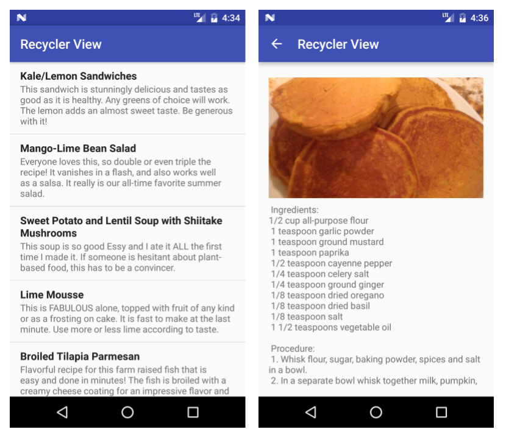

# Travail à faire

## Créer et exécuter une application

Créer une application qui utilise un `RecyclerView` pour afficher une liste de recettes. Chaque élément de la liste doit indiquer le nom de la recette avec une courte description. Lorsque l'utilisateur appuie sur une recette (un élément de la liste), démarrer une activité (`Activity`) qui affiche le texte complet de la recette.

* Utiliser des éléments et un style `TextView` distincts pour le nom et la description de la recette.
* Il est ossible d'utiliser un texte d'espace réservé (placeholder) pour les recettes complètes.
* En option, ajouter une image du plat fini à chaque recette.
* Cliquer sur le bouton Haut ramène l'utilisateur à la liste des recettes.

La capture d'écran ci-dessous montre un exemple d'implémentation simple. L'application peut avoir un aspect très différent, tant qu'elle dispose des fonctionnalités requises.

## Répondre à ces questions

### **Question 1**

Laquelle des affirmations suivantes concernant une `RecyclerView` est fausse ? Choisissez-en un.

- [ ] Un `RecyclerView` est un moyen plus économe en ressources pour afficher des listes déroulantes.
- [ ] Il faut fournir une mise en page (layout) pour un seul élément de la liste.
- [ ] Tous les éléments de la liste se ressemblent.
- [ ] on a pas besoin d'un gestionnaire de disposition (layout manager) avec un `RecyclerView` pour gérer la hiérarchie et la disposition des éléments `View`.

### **Question 2**

Lequel des éléments suivants est le composant principal dont vous avez besoin pour fournir à un adaptateur un élément de vue et sa position dans un `RecyclerView`?Choisissez-en un.

- [ ] `RecyclerView`
- [ ] `RecyclerView.Adapter`
- [ ] `RecyclerView.ViewHolder`
- [ ] `AppCompatActivity`

### **Question 3**

Quelle interface doit-on implémenter pour écouter et répondre aux clics des utilisateurs dans une `RecyclerView`? Choisissez-en un.

- [ ] `View.onClickListener`
- [ ] `RecyclerView.Adapter`
- [ ] `RecyclerView.ViewHolder`
- [ ] `View.OnKeyListener`

## Soumettez votre application pour la notation

Vérifier que l'application dispose des fonctionnalités suivantes :

* Implémente un `RecyclerView` qui affiche une liste déroulante de titres de recettes et de courtes descriptions.
* Le code étend ou implémente `RecyclerView`, `RecyclerView.Adapter`, `RecyclerView.ViewHolder` et `View.OnClickListener`.
* Cliquer sur un élément de la liste démarre une activité (`Activity`) qui affiche la recette complète.
* Le fichier `AndroidManifest.xml` définit une relation parent de sorte que cliquer sur le bouton Haut dans une vue de recette revient à la liste des recettes.
* `ViewHolder` contient une mise en page avec deux éléments `TextView`; par exemple, un `LinearLayout` avec deux éléments `TextView`.
